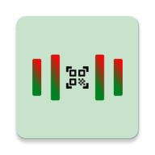
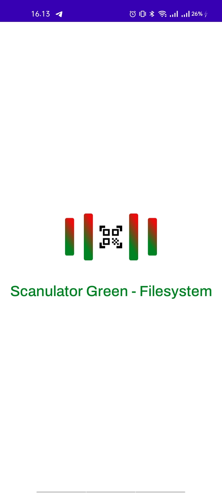
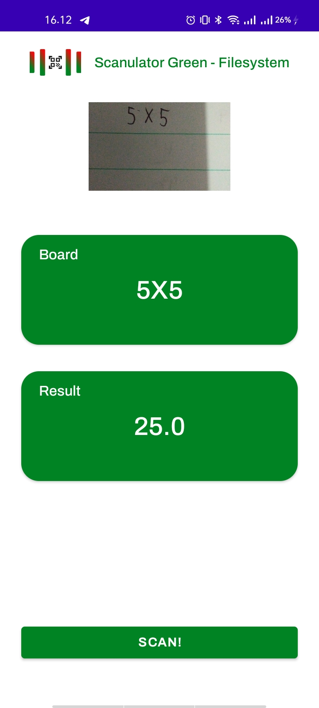

 

  

  <h3 align="center">Scanulator</h3>

  

     
    <a href="https://github.com/codernewbie04/Scanulator/releases">View Demo</a>
  

## Mock-Up
[Figma](https://www.figma.com/file/A9nCNnYwjSlTmnpBehBqXm/Scanulator?type=design&node-id=1%3A4&mode=design&t=XVBp9rjAIhwnIi8f-1)

## REST API Documentation
[OCR](https://ocr.space/OCRAPI)

## Preview

  
  

### Key Features
* Scanning Math
## Technology
* Kotlin
* Dagger-Hilt
* Retrofit2
